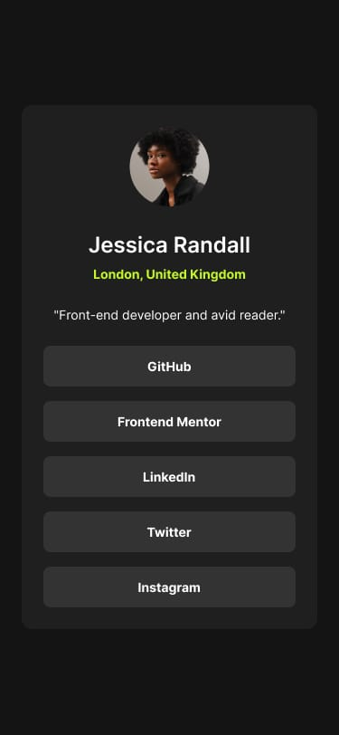

#  Profile Card Component

##  Overview
This project is a **Profile Card UI component**, inspired by a Frontend Mentor challenge.  

The objective was to **improve the user interface**, add **interactive hover effects**, and build a **fully responsive layout** that works smoothly across all devices.

---

##  The Challenge
Users should be able to:
- See hover states for interactive elements  
- Experience smooth and intuitive interactions  
- View an optimal layout depending on their screen size (mobile & desktop)  

---

##  Screenshot - Mobile view


---

## 🔗 Links
- Solution URL: [not yet deployed](#)  
- Live Site URL: [not yet deployed](#)  

---

## My Process

### Built With
- Semantic HTML5 markup  
- CSS3 (Flexbox & responsive design)  
- Mobile-first workflow  

---

## What I Learned
During this project, I improved my ability to:

- Design clean and modern UI components  
- Implement **hover effects** for better user interaction  
- Structure layouts using **Flexbox**  
- Apply **responsive design principles**  

I also learned how small improvements in spacing, typography, and interactivity can significantly enhance the user experience.

---

## Code Example

### HTML Structure
```html
<div class="profile-card">
  
  <h1>Jessica Randal</h1>
  <p>Frontend Developer</p>
  <div class="social-links">
    <a href="https://github.com/David-max-tech" class="social-link">GitHub</a>
    <a href="https://linkedin.com/in/David-mumeme" class="social-link">LinkedIn</a>
  </div>
</div>
## Hover Effect (CSS)

.social-link:hover {
  transform: scale(1.1);
  transition: 0.3s ease;
  filter: brightness(1.2);
}
## AI Collaboration

AI assisted me in:

Suggesting UI and interaction improvements
Debugging and optimizing HTML & CSS
Structuring the project efficiently
Writing a clean and professional README

This helped me work faster and produce a more polished result.

## 📂 Project Structure

/index.html        # Main profile card page  
/style/            # CSS, images, icons  
README.md          # Project documentation 

##  Author

- Frontend Mentor - https://www.frontendmentor.io/profile/David-max-tech
- GitHub - https://github.com/David-max-tech